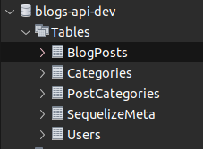

#  Blogs API ! 

### Projeto desenvolvido utilizando Node.js, Sequelize e JWT.

###### Neste projeto foi desenvolvido uma API e um banco de dados para a produção de conteúdo para um blog!

###### A API tem um CRUD completo, utilizando os princípios REST, e validando login com JWT.

# Blogs API

Este projeto trata-se de uma API e um banco de dados para a produção de conteúdo para um blog!

> Desafios:
>
>  1. Desenvolver endpoints que estarão conectados ao banco de dados seguindo os princípios do REST;
>
>  2. Para fazer um post é necessário usuário e login, portanto será trabalhada a relação entre user e post;
>
>  3. Será necessária a utilização de categorias para os posts, trabalhando, assim, a relação de posts para categories e de categories para posts.
>

## Técnologias usadas

Back-end:
> Desenvolvido usando: Node.js, Express.js, Docker, Sequelize, JWT

## Habilidades

Adquiri essas habilidades ao desenvolver esse projeto:

- Aderência do código à especificação. O programa deve se comportar como especificado na próxima seção.

- Organização do código.

- A qualidade e a cobertura dos testes.

## Preview da Aplicação

| Diagrama DER |
| :---: |
|  |
| | |

## Instalando Dependências

> Clone o projeto:

  ```bash
  git clone git@github.com:El1v/blogs-api.git
  ```

> Docker

  :heavy_exclamation_mark: Rode os serviços **node** e **db** com o comando.

  ```bash
  docker-compose up -d --build
  ```

  > Esses serviços irão inicializar um container chamado `blogs_api` e outro chamado `blogs_api_db`.

  ```bash
  docker exec -it blogs_api bash
  ```

> Back-end

  ```bash
  npm install
  ```

## Executando aplicação

- Para rodar o `Banco de dados`

  ```bash
  npm run drop
  # "npx sequelize-cli db:drop"
  ```

  Cria o banco e realiza as `Migration`

  ```bash
  npm run createdb
  # npx sequelize-cli db:create && npx sequelize-cli db:migrate
  ```

  Popula o banco de dados

  ```bash
  npm run seed
  # npx sequelize-cli db:seed:all
  ```

  O banco devera ter essas tabelas

  |.| Tablelas do banco |.|
  | --- | :---: | --- |
  ||  ||
  || ||

- Para rodar o `Back-end`:

  :warning: Use esses comandos dentro do container

  ```bash
  npm start
  ```

- Modo desenvolvimento:

  ```bash
  npm run debug
  ```

> Rota da Documentação do Swagger:

  ```docker
  localhost:3000/
  ```
